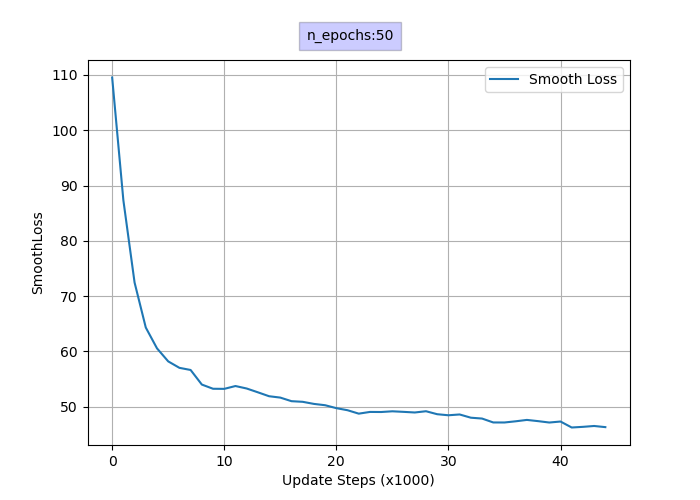

## A RNN Text Generator Made From Scratch in Python

Recurrent Neural Network (RNN) Implemented in Python from scratch without any support libraries to fully learn the network architecture and mathematics. The goal was to implement a Text Generator where it learned from the text of Harry Potter Books to create meaningful sentences. 

## Modules Implemented by hand
- Back-propagation Algorithm (including hidden-state)
- Gradient Descent Algorithm (including hidden-state)
- Text preprocessing and encoding
- Text Synthesizer

## Model Performance

To test the performance of the network, it was trained during 50 epochs, almost 2.2 million update steps and the lowest smooth loss that was achieved was 38.86 and its development can be seen in the graph below.

